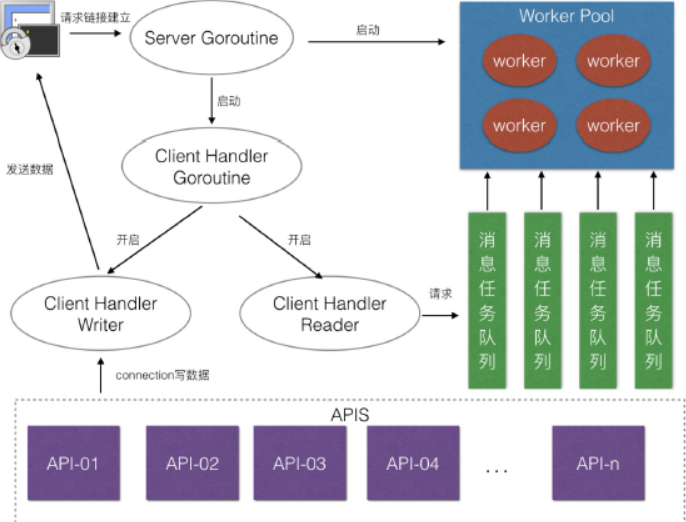
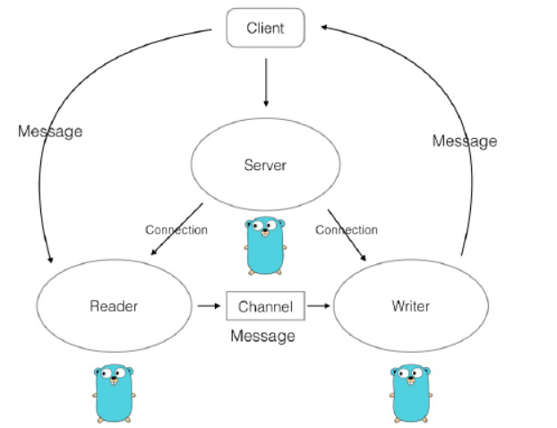
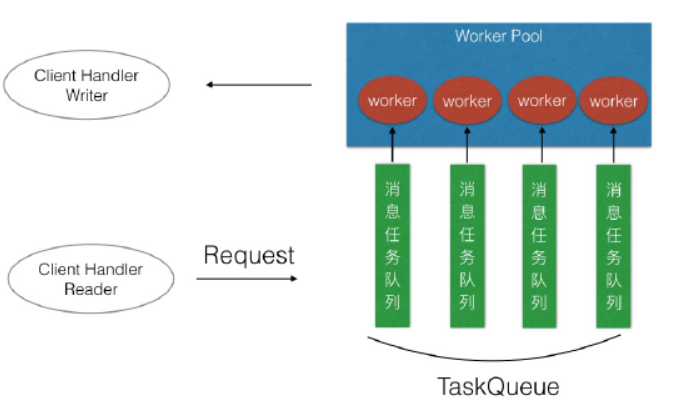

# 项目介绍

    pinx框架是一个基于tcp协议的并发服务器, 项目流程图如下:



    建立连接后会开启三个goroutine

        - read : 对数据读取，拆包 开启msghandler协程
        - write : 收到sendmsg的chan信息后， 调用tcp的send方法发包 
        - Handle : 根据msgid 调用对应的业务逻辑方法，如果有必要，通过sendmsg方法发包到write协程

## 消息封装

    基本报文格式是

```
type Message struct {
    Id      uint32 // 消息的ID
    DataLen uint32 //消息的长度
    Data    []byte // 消息的内容
}
```

## 多路由模式

    通过Apis的map来实现路由的注册和删除

```
type MsgHandle struct {
    Apis           map[uint32]pinterface.IRouter
    WorkerPoolSize uint32
    TaskQueue      []chan pinterface.IRequest
}
```

## 读写分离

    在connection.go 中的startread 和starwrite 是分开的，他们的信息传递是通过一个channel来传递的。让框架的耦合度降低.


## 消息队列

        起初的框架设计是读到一个message包后，开启一个Goroutine。这种情况下在应对每个连接请求数较少的情况是可以的，如果有高并发，就需要建立一个协程池，来减少过的的协程带来的调度上的开销。
        实现的方法是建立一个Goroutine池，每个Goroutine有一个channel，通过轮询的方法为每个连接的请求分配Goroutine



## 连接管理

    连接管理分为两部分:
        - 为连接添加钩子函数(Hook), 在每次连接开始和结束时候添加函数，这样做在游戏项目的玩家上线下线可以用到。
        - 为连接添加属性，比如玩家登录后为连接添加playerid的属性。

