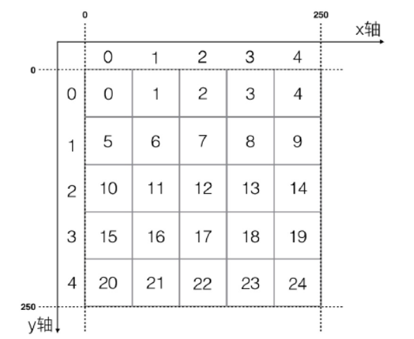

# MMO游戏实践

    基于pinx框架，实现了了mmo游戏的基础模块aoi(基于兴趣范围的广播), 世界聊天等。

### AOI算法

>AOI(Area Of Interest)在MMOPRG游戏服务器上是不可或缺的技术，广义上，AOI系统支持任何游戏世界中的物体个体对一定半径范围内发生的事件进行处理；但MMOPRG上绝大多数需求只是对半径范围内发生的物体离开/进入事件进行处理。当你进入一个游戏场景时，如果你能看到其他玩家，那背后AOI系统就正在运作。显然,AOI实现方案的好坏直接决定了服务器能够承载的同时在线人数上限，也决定了策划对游戏玩法的发挥程度。

#### 网络法实现AOI算法
    简单的2D地图

* 场景大小： 250*250 ， w(x轴宽度) = 250，l(y轴长度) = 250
* x轴格子数量：nx = 5
* y轴格子数量：ny = 5
* 格子宽度: dx = w / nx = 250 / 5 = 50
* 格子长度: dy = l / ny = 250 / 5 = 50
* 格子的x轴坐标：idx
* 格子的y轴坐标：idy

建立一个格子类grid 和一个aoi地图类, 通过grid的GetSurroundGridsByGid() 方法可以得到周围的格子，是算法的核心。

### protocol buffer协议
    该项目采用的是Google Protocol Buffer协议。

    B)protobuf的优势与劣势
>优势：
>1. 序列化后体积相比Json和XML很小，适合网络传输
>2. 支持跨平台多语言
>3. 消息格式升级和兼容性还不错
>4. 序列化反序列化速度很快，快于Json的处理速速

>劣势：
>1. 应用不够广(相比xml和json)
>2. 二进制格式导致可读性差
>3. 缺乏自描述

### 上线功能

    上线功能模块实在连接管理的Hook函数中写的，主要做了两件事:
        1. 返回MsgId = 1 的包，把生成的玩家ID返回给客户端。
        2. 返回MsgId = 200 的包， 玩家的坐标传给客户端。

### 下线功能

    1. 获取周围玩家的信息
    2. 同步信息发送到周围玩家

### 世界聊天

    世界聊天是当玩家打字发送Msgid = 2的包后后所有人都能看到：
        1. 给该玩家发送Msgid = 200的包
        2. 获取所有在线玩家的信息GetAllPlayers()， 给所有在线玩家发送Msgid = 200的包。

### 上线位置同步

    1. 同步pid至客户端
    2. 获取周围玩家信息
    3. 同步玩家信息到客户端
    4. 同步周围玩家信息至客户端

### 移动位置与AOI广播

    1. 计算玩家的新旧位置所处的格子ID
    2. 更新玩家的坐标
    3. 判断玩家是否跨越格子
    4. 获取新位置周围的玩家
    5. 广播新位置给周围的玩家
